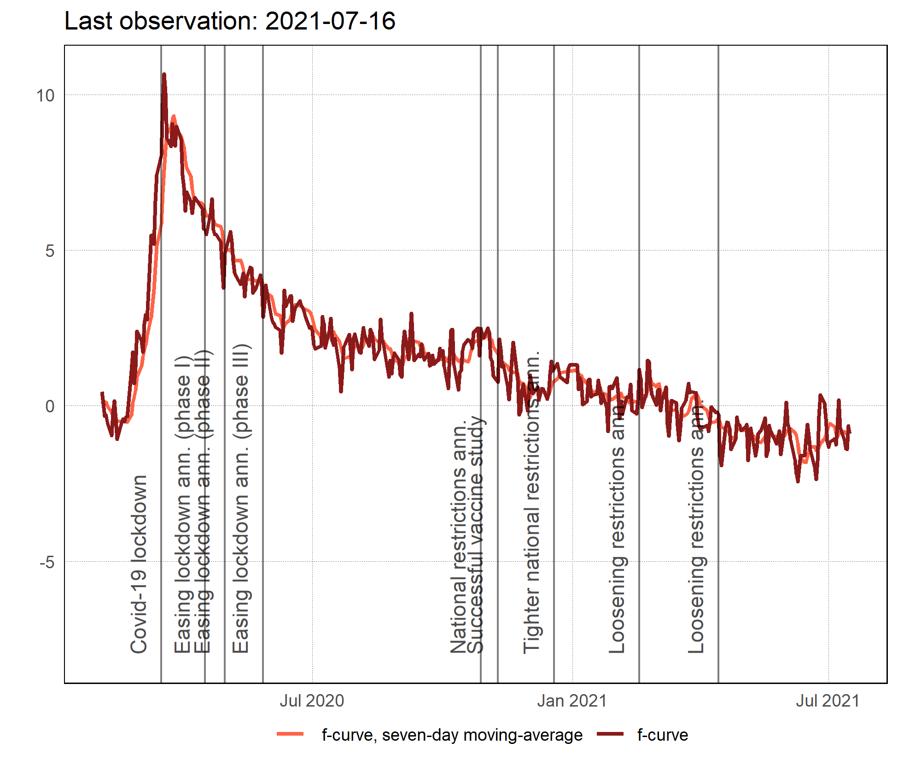
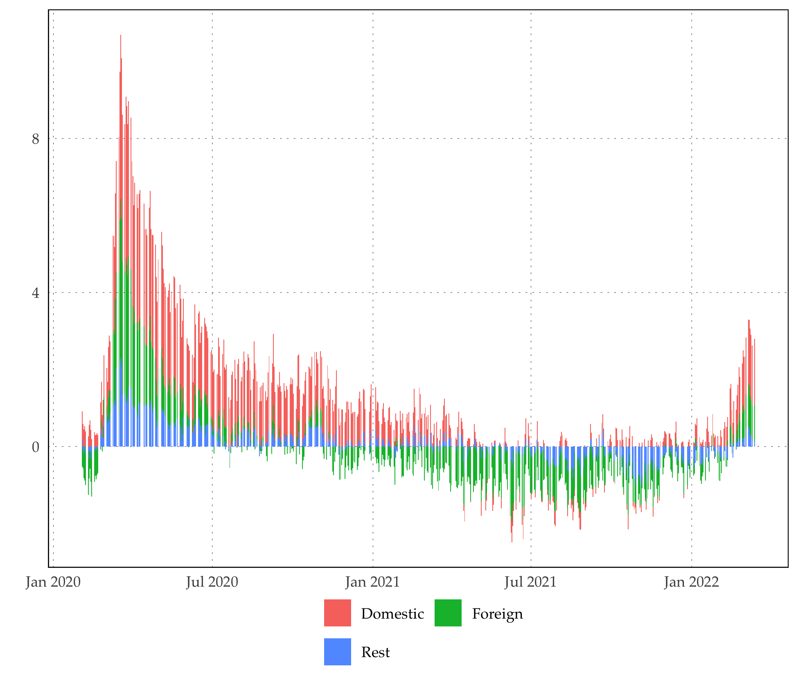
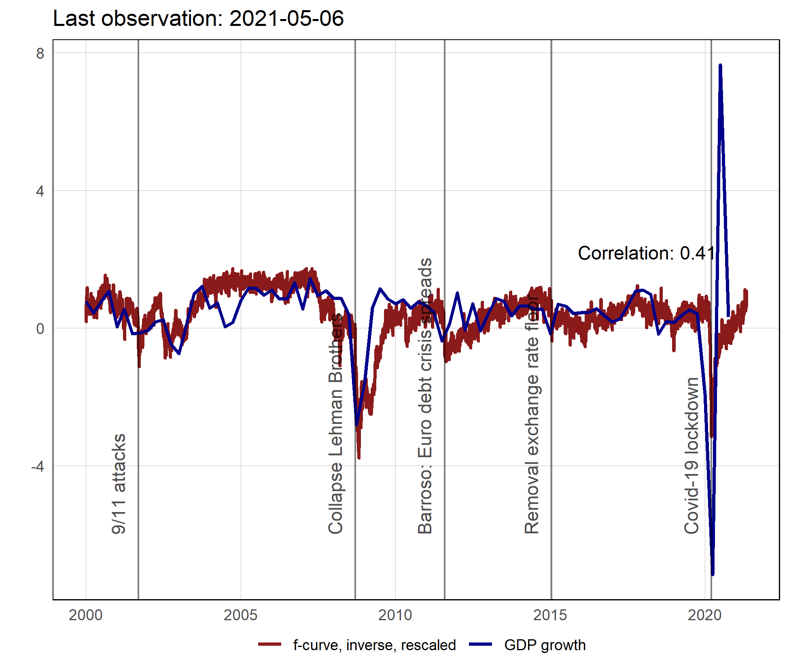
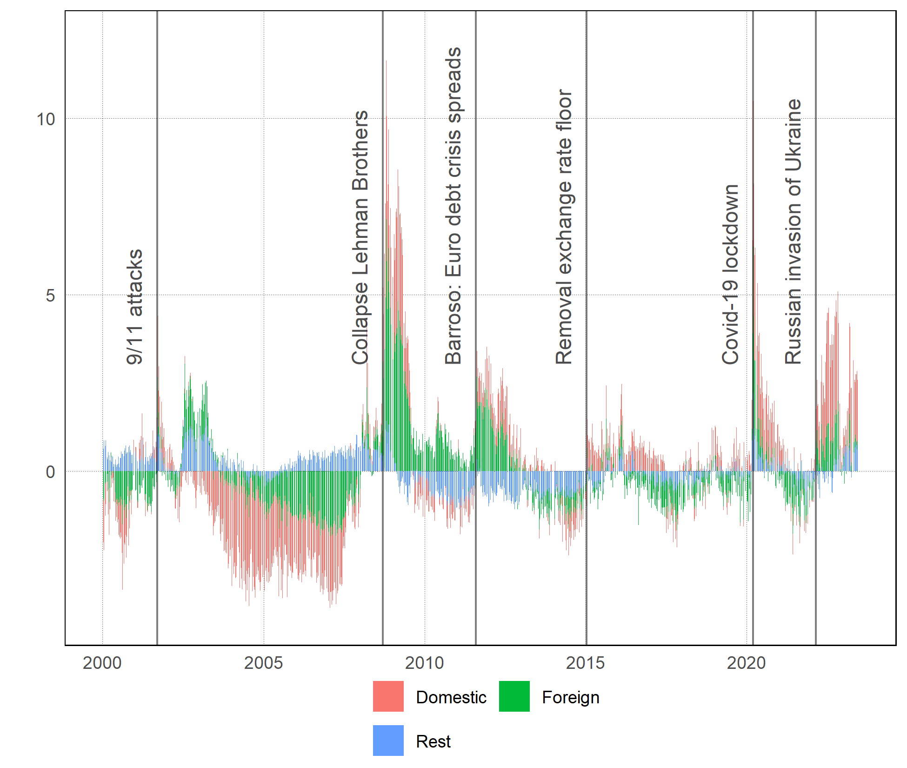

# f-curve
*A daily fever curve for the Swiss economy: Stable version*

**Abstract:**  Because macroeconomic data is published with a substantial delay assessing the health of the economy during the rapidly evolving Covid-19 crisis is challenging. We develop a fever curve for the Swiss economy using publicly available daily financial market and news data. The indicator can usually be computed with a delay of one working day. Moreover, it is highly correlated with macroeconomic and survey indicators of Swiss real economic activity; therefore, it provides timely and reliable warning signals if health of the economy takes a turn for the worse.

**JEL classification:** E32, E37, C53

**Keywords:** Covid-19, Leading indicator, Financial market data, Forecasting, Switzerland

# Current f-curve:

# Current GDP forecast:


# Historical correlation with GDP growth

<figure>
  
  <figcaption>Fig.1 - Trulli, Puglia, Italy.</figcaption>
</figure>