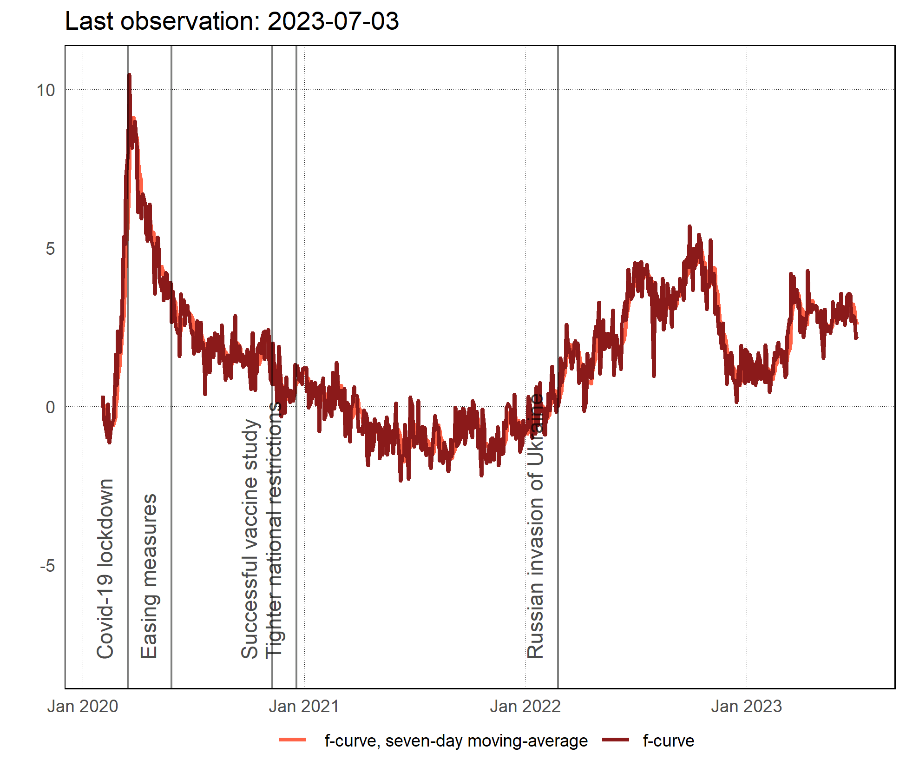
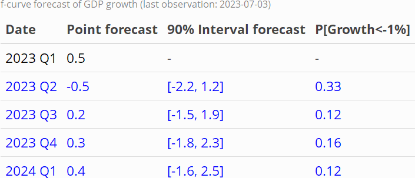
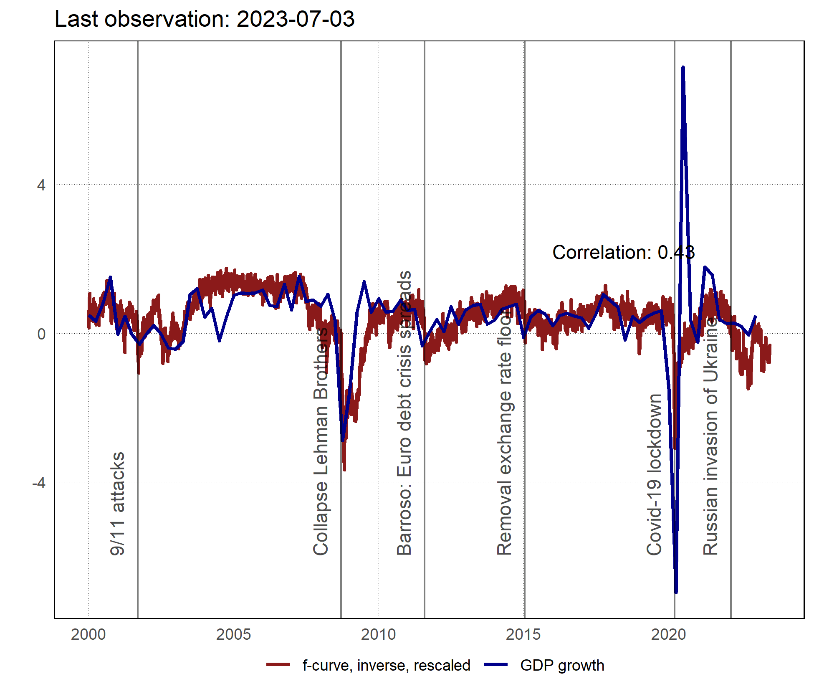

# f-curve
## A daily fever curve for the Swiss economy v1.0

**Abstract:**  Because macroeconomic data is published with a substantial delay, assessing the health of the economy during the rapidly evolving Covid-19 crisis is challenging. We develop a fever curve for the Swiss economy using publicly available daily financial market and news data. The indicator can be computed with a delay of one day. Moreover, it is highly correlated with macroeconomic data and survey indicators of Swiss economic activity. Therefore, it provides timely and reliable warning signals if the health of the economy takes a turn for the worse.

**JEL classification:** E32, E37, C53

**Keywords:** Covid-19, Leading indicator, Financial market data, News sentiment, Forecasting, Switzerland

**Recommended citation:** [Burri](https://www.linkedin.com/in/marc-burri-a64628196/) Marc and Daniel [Kaufmann](https://dankaufmann.com): "A daily fever curve for the Swiss economy", IRENE Working Paper No. 20-05, v1.0: [github.com/dankaufmann/f-curve](https://github.com/dankaufmann/f-curve)

## Download current data and installation instructions
[f-curve data (csv)](./Results/f-curve-data.csv) | [Working Paper](./f-curve_WP_20-05.pdf) | [Installation instructions](./WebScraping.md)

The updated f-curve is available daily around 11 am.
 
## Current f-curve:

## Current GDP growth forecast:

## Historical correlation with GDP growth

